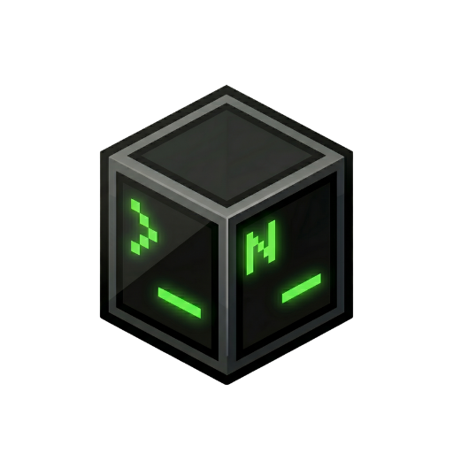

<div align="center">
  
  
  # NexMC
  
  ### Minecraft Sunucu Yönetimi Artık Kolay
  
  [](LICENSE.txt)
  []()
  []()
  [](https://discord.gg/3zF5TwBgpRs)
  
  [Özellikler](#-özellikler) • [İndir](#-kurulum) • [Kullanım](#-kullanım)
</div>

---

## 🎯 NexMC Nedir?

NexMC, Minecraft sunucularını **tek tıkla** oluşturmanıza, yönetmenize ve özelleştirmenize olanak sağlayan modern bir masaüstü uygulamasıdır. Paper, Forge, Fabric, Purpur ve daha fazlasını destekler. Terminal komutları, karmaşık kurulumlar veya teknik bilgiye ihtiyaç duymadan profesyonel bir sunucu deneyimi sunar.

### 💡 Neden NexMC?

| Manuel Kurulum | NexMC |
|----------------|-------|
| ⏱️ ~15-20 dakika | ⚡ ~2 dakika |
| 🔧 Java manuel kurulumu | ✅ Otomatik Java yönetimi |
| 📦 Plugin'leri web'den indir, kopyala | 🛍️ Uygulama içi mağaza |
| ❌ Yedekleme sistemi yok | ✅ Tek tıkla yedekleme |
| ❌ Kaynak izleme yok | 📊 Canlı CPU/RAM grafikleri |
| 🤯 Yüksek teknik bilgi | 😊 Sıfır teknik bilgi |

---

## ✨ Özellikler

### 🚀 Tek Tıkla Kurulum
- **9 Farklı Sunucu Yazılımı:** Paper, Purpur, Fabric, Forge, Folia, Velocity, Waterfall, Spigot, Vanilla
- **Otomatik Java Yönetimi:** Java 8, 17 ve 21 otomatik indirme ve yapılandırma
- **500+ Minecraft Sürümü:** 1.8'den 1.21+'e kadar tüm sürümler
- **Akıllı Sürüm Algılama:** Sunucu yazılımına göre uygun Java versiyonu otomatik seçilir

### 🛍️ Plugin & Mod Mağazası
- **50,000+ Plugin:** SpigotMC entegrasyonu ile binlerce plugin
- **Modrinth Desteği:** Fabric ve Forge modlarını arayın ve yükleyin
- **Sürüm Filtreleme:** Minecraft sürümünüze uygun plugin/mod'ları görün
- **Tek Tıkla Kurulum:** İndirme ve kurulum tamamen otomatik

### 📁 Gelişmiş Dosya Yöneticisi
- **Monaco Editor:** VS Code editörü ile kod düzenleme
- **Söz Dizimi Vurgulama:** YAML, JSON, Properties, Java desteği
- **Dosya Silme/Düzenleme:** Tam yetkili dosya yönetimi

### 📊 Gerçek Zamanlı İzleme
- **Canlı Grafikler:** CPU ve RAM kullanımını anlık görün
- **Konsol Çıktıları:** Renklendirilmiş ve filtrelenebilir log'lar
- **Performans Geçmişi:** Son 20 ölçümü grafik üzerinde takip edin
- **Sistem Bilgileri:** Sunucu durumu, port, versiyon bilgileri

### 💾 Akıllı Yedekleme Sistemi
- **Tek Tıkla Yedekleme:** Tüm sunucu dosyalarını yedekleyin
- **Geri Yükleme:** Eski sürüme saniyeler içinde dönün
- **Otomatik Zamanlama:** Belirli aralıklarla otomatik yedekleme
- **Sıkıştırma:** ZIP formatında küçük ve taşınabilir

### ⏰ Görev Zamanlayıcı
- **Otomatik Yeniden Başlatma:** Günlük/haftalık restart planı
- **Komut Çalıştırma:** Belirli saatlerde komut gönderme
- **Yedekleme Planı:** Düzenli aralıklarla otomatik backup
- **Esnek Ayarlar:** Dakika, saat, gün bazında zamanlama

### 🎮 Oyuncu Yönetimi
- **Whitelist:** İzin verilen oyuncu listesi
- **OP Listesi:** Yönetici yetkili oyuncular
- **Ban Sistemi:** Oyuncu ve IP bazlı yasaklamalar
- **Toplu İşlemler:** Birden fazla oyuncuya aynı anda işlem

---

## 💻 Sistem Gereksinimleri

### Minimum
- **İşletim Sistemi:** Windows 10/11, macOS 10.15+, Linux (Ubuntu 20.04+)
- **İşlemci:** Intel Core i3 veya AMD Ryzen 3
- **RAM:** 4 GB
- **Disk Alanı:** 2 GB boş alan
- **İnternet:** Kurulum için gerekli

### Önerilen
- **İşletim Sistemi:** Windows 11, macOS 12+, Linux (Ubuntu 22.04+)
- **İşlemci:** Intel Core i5 veya AMD Ryzen 5
- **RAM:** 8 GB veya üzeri
- **Disk Alanı:** 10 GB+ (Sunucu dünyaları için)
- **İnternet:** Stabil bağlantı

---

## 📥 Kurulum

### Windows
1. [NexMC-Setup-v1.0.0.exe](eklenecek) dosyasını indirin
2. İndirilen dosyayı çalıştırın
3. Kurulum sihirbazını takip edin
4. NexMC'yi başlatın ve ilk sunucunuzu oluşturun!

### macOS
```bash
# Homebrew ile
brew install --cask nexmc

# Manuel kurulum
# NexMC-v1.0.0.dmg dosyasını indirin ve çift tıklayın
```

### Linux
```bash
# AppImage
chmod +x NexMC-v1.0.0.AppImage
./NexMC-v1.0.0.AppImage

# Debian/Ubuntu (.deb)
sudo dpkg -i nexmc_1.0.0_amd64.deb

# Fedora/RHEL (.rpm)
sudo rpm -i nexmc-1.0.0.x86_64.rpm
```

---

## 🎯 Kullanım

### İlk Sunucu Oluşturma

1. **Yeni Sunucu** butonuna tıklayın
2. **Sunucu Yazılımı Seçin:** Paper, Forge, Fabric vb.
3. **Minecraft Sürümünü Seçin:** 1.21.4, 1.20.1 vb.
4. **RAM Miktarını Ayarlayın:** Slider ile 1-16 GB arası
5. **İsim Verin ve Oluşturun:** "Survival SMP", "Modlu Sunucu" vb.

### Plugin Kurulumu

```
1. Sunucunuzu seçin
2. "Pluginler" sekmesine gidin
3. Arama çubuğuna plugin adını yazın (örn: "EssentialsX")
4. Listeden plugin'i seçin
5. Sürüm seçin ve "Kur" butonuna tıklayın
```

### Sunucu Başlatma

```
1. Sunucunuzu listeden seçin
2. Yeşil "Başlat" butonuna tıklayın
3. Java otomatik indirilecek ve sunucu başlatılacak
4. Konsol sekmesinde logları izleyin
```

### Dosya Düzenleme

```
1. "Dosyalar" sekmesine gidin
2. Düzenlemek istediğiniz dosyayı bulun (örn: server.properties)
3. Çift tıklayarak Monaco Editor'de açın
4. Değişikliklerinizi yapın
5. Ctrl+S veya "Kaydet" butonuna basın
```

---

## 🗺️ Yol Haritası

### v1.0.0 Proje Yayınlanması Planlandı

---

## 📝 Changelog

### v1.0.0 (Yayınlanma Planlandı)

[Tüm değişiklikleri görüntüle →](CHANGELOG.md)

---

## 📄 Lisans

Bu proje [MIT Lisansı](LICENSE.txt) ile lisanslanmıştır. Özgürce kullanabilir, değiştirebilir ve dağıtabilirsiniz.

---

### Dokümantasyon

- 📖 [Resmi Dokümantasyon](Eklenecek)
- 🎥 [Video Eğitimleri](https://youtube.com/@rynixdev)

## 🙏 Teşekkürler

- [PaperMC](https://papermc.io/) - Paper, Velocity, Waterfall için
- [Modrinth](https://modrinth.com/) - Mod API'si için
- [SpigotMC](https://www.spigotmc.org/) - Plugin API'si için
- [Electron](https://www.electronjs.org/) - Desktop framework için
- [Next.js](https://nextjs.org/) - Web framework için

---

<div align="center">
  
  ### ⭐ Projeyi beğendiyseniz yıldız vermeyi unutmayın!
  
  **NexMC ile Minecraft sunucu yönetimi artık çok kolay! 🎮**
  
  [Website](https://nexmc.js.org) • [Discord](https://discord.gg/3zF5TwBgpRs)
  
</div>
